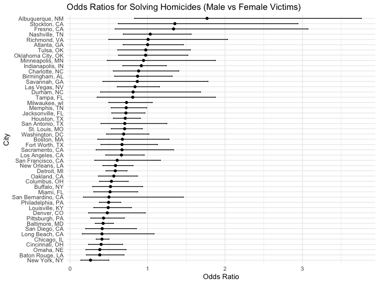

p8105 Homework 6
================
2024-12-03

Name \[UNI\]: Xi Peng \[xp2213\]

# Question 1: 2017 Central Park weather data

``` r
# Dataset download and processes.
weather_df = 
  rnoaa::meteo_pull_monitors(
    c("USW00094728"),
    var = c("PRCP", "TMIN", "TMAX"), 
    date_min = "2017-01-01",
    date_max = "2017-12-31") %>%
  mutate(
    name = recode(id, USW00094728 = "CentralPark_NY"),
    tmin = tmin / 10,
    tmax = tmax / 10) %>%
  select(name, id, everything())
```

    ## using cached file: /Users/eeeeee/Library/Caches/org.R-project.R/R/rnoaa/noaa_ghcnd/USW00094728.dly

    ## date created (size, mb): 2024-12-01 21:13:47.558893 (8.667)

    ## file min/max dates: 1869-01-01 / 2024-11-30

``` r
# Define a bootstrap sampling function.
boot_sample = function(df) {
  sample_frac(df, replace = TRUE)
}

# Bootstrap resampling.
boot_straps_result = tibble(strap_number = 1:5000) |> 
  mutate(
    strap_sample = map(strap_number, ~ boot_sample(weather_df)),
    models = map(strap_sample, ~ lm(tmax ~ tmin, data = .x)),
    results = map(models, tidy),                         
    r_squared = map_dbl(models, ~ glance(.x)$r.squared), 
    log_beta_product = map_dbl(models, ~ {       
      coefs = tidy(.x)  
      beta_0 = coefs |> filter(term == "(Intercept)") |> pull(estimate)
      beta_1 = coefs |> filter(term == "tmin") |> pull(estimate)
      log(abs(beta_0 * beta_1))
    })
  )

boot_straps_result
```

    ## # A tibble: 5,000 × 6
    ##    strap_number strap_sample       models results  r_squared log_beta_product
    ##           <int> <list>             <list> <list>       <dbl>            <dbl>
    ##  1            1 <tibble [365 × 6]> <lm>   <tibble>     0.912             2.01
    ##  2            2 <tibble [365 × 6]> <lm>   <tibble>     0.908             2.05
    ##  3            3 <tibble [365 × 6]> <lm>   <tibble>     0.912             2.03
    ##  4            4 <tibble [365 × 6]> <lm>   <tibble>     0.915             2.01
    ##  5            5 <tibble [365 × 6]> <lm>   <tibble>     0.898             2.00
    ##  6            6 <tibble [365 × 6]> <lm>   <tibble>     0.927             2.01
    ##  7            7 <tibble [365 × 6]> <lm>   <tibble>     0.905             2.02
    ##  8            8 <tibble [365 × 6]> <lm>   <tibble>     0.912             2.03
    ##  9            9 <tibble [365 × 6]> <lm>   <tibble>     0.922             2.02
    ## 10           10 <tibble [365 × 6]> <lm>   <tibble>     0.907             2.03
    ## # ℹ 4,990 more rows

<br> Plot the distribution of the estimates of the two quantities.

``` r
boot_straps_plot = 
  boot_straps_result |>
  select(r_squared, log_beta_product) |> 
  pivot_longer(cols = everything(), names_to = "metric", values_to = "value") |> 
  ggplot(aes(x = value)) +
  geom_density(alpha = 0.3) +
  facet_wrap(~metric, scales = "free") +
  labs(
    title = "Bootstrap Distributions of R^2 and log(β0 * β1)",
    x = "Value",
    y = "Density"
  )

boot_straps_plot
```


Both distributions show clear, bell-shaped curves with minimal skewness,
indicating that these statistics are stable and reliable across
different bootstrap samples.The plot indicates a strong linear
relationship between tmax and tmin in the weather data, as reflected by
the consistently high r_squared values and stable log_beta_product
values across 5000 bootstrap samples. The narrow distribution of
r_squared values demonstrates that the model explains a substantial
proportion of the variance in tmax, while the consistency of the
log_beta_product values indicates minimal variability in the
relationship between the coefficients. The large sample size of 5000
ensures that the distributions capture the true underlying pattern with
minimal variation across resampled datasets.

<br> 95% confidence interval for the two quantities.

``` r
CI_result = boot_straps_result |> 
  summarize(
    r_squared_CI = list(quantile(r_squared, c(0.025,0.975))),
    log_beta_product_CI = list(quantile(log_beta_product, c(0.025, 0.975)))
  ) 

knitr::kable(CI_result)
```

| r_squared_CI         | log_beta_product_CI |
|:---------------------|:--------------------|
| 0.8942244, 0.9271528 | 1.965358, 2.059243  |

# Question 2: Homicide Rates Across U.S. Cities

``` r
url = "https://raw.githubusercontent.com/washingtonpost/data-homicides/refs/heads/master/homicide-data.csv"

homi_data = read_csv(url) |> 
  janitor::clean_names() |> 
  mutate(
    city_state = str_c(city, ", ", state),
    resolved = as.numeric(disposition == "Closed by arrest"),
    victim_age = as.numeric(victim_age)
  ) |> 
  filter(
    !city_state %in% c("Dallas, TX", "Phoenix, AZ", "Kansas City, MO", "Tulsa, AL"),
    victim_race %in% c("White", "Black"), 
    !is.na(victim_age)
  )
```

    ## Rows: 52179 Columns: 12
    ## ── Column specification ────────────────────────────────────────────────────────
    ## Delimiter: ","
    ## chr (9): uid, victim_last, victim_first, victim_race, victim_age, victim_sex...
    ## dbl (3): reported_date, lat, lon
    ## 
    ## ℹ Use `spec()` to retrieve the full column specification for this data.
    ## ℹ Specify the column types or set `show_col_types = FALSE` to quiet this message.

In this step, the original dataset is imported, and two key variables
are created: city_state, which combines the city and state names, and a
binary variable, resolved, indicating whether the homicide was solved.
Cities that do not report victim race, such as Dallas, TX; Phoenix, AZ;
and Kansas City, MO, are excluded, along with Tulsa, AL, due to a data
entry error. The analysis is further narrowed to include only cases
where victim_race is recorded as either “White” or “Black” and
victim_age is confirmed as a numeric value.

<br> Analyze for Baltimore, MD

``` r
# Filter data for Baltimore, MD
Bal_MD = homi_data |> 
  filter(city_state == "Baltimore, MD") 

# Fit a logistic regression
Bal_MD_fit = glm(
  resolved ~ victim_age + victim_race + victim_sex,
  data = Bal_MD, family = binomial()
) |> 
  tidy()

knitr::kable(Bal_MD_fit, digits = 3)
```

| term             | estimate | std.error | statistic | p.value |
|:-----------------|---------:|----------:|----------:|--------:|
| (Intercept)      |    0.310 |     0.171 |     1.810 |   0.070 |
| victim_age       |   -0.007 |     0.003 |    -2.024 |   0.043 |
| victim_raceWhite |    0.842 |     0.175 |     4.818 |   0.000 |
| victim_sexMale   |   -0.854 |     0.138 |    -6.184 |   0.000 |

``` r
ORmale_Bal_MD = Bal_MD_fit |> 
  mutate(
    OR = exp(estimate),
    lower_CI = exp(estimate - 1.96 * std.error),
    upper_CI = exp(estimate + 1.96 * std.error)
  ) |> 
  filter(term == "victim_sexMale") |> 
  select(term, OR, lower_CI, upper_CI)

knitr::kable(ORmale_Bal_MD, digits = 3)
```

| term           |    OR | lower_CI | upper_CI |
|:---------------|------:|---------:|---------:|
| victim_sexMale | 0.426 |    0.325 |    0.558 |

``` r
# Fit a logistic regression for each city
all_city_results <- homi_data |> 
  group_by(city_state) |> 
  nest() |> 
  mutate(
    model = map(data, ~ glm(resolved ~ victim_age + victim_race + victim_sex, 
                            data = .x, family = binomial())),
    tidy_results = map(model, ~ tidy(.x) |> 
                         filter(term == "victim_sexMale") |> 
                         mutate(
                           OR = exp(estimate),
                           lower_CI = exp(estimate - 1.96 * std.error),
                           upper_CI = exp(estimate + 1.96 * std.error)
                         ))
  ) |> 
  unnest(tidy_results) |> 
  select(city_state, OR, lower_CI, upper_CI)

knitr::kable(all_city_results, digits = 3)
```

| city_state         |    OR | lower_CI | upper_CI |
|:-------------------|------:|---------:|---------:|
| Albuquerque, NM    | 1.767 |    0.831 |    3.761 |
| Atlanta, GA        | 1.000 |    0.684 |    1.463 |
| Baltimore, MD      | 0.426 |    0.325 |    0.558 |
| Baton Rouge, LA    | 0.381 |    0.209 |    0.695 |
| Birmingham, AL     | 0.870 |    0.574 |    1.318 |
| Boston, MA         | 0.674 |    0.356 |    1.276 |
| Buffalo, NY        | 0.521 |    0.290 |    0.935 |
| Charlotte, NC      | 0.884 |    0.557 |    1.403 |
| Chicago, IL        | 0.410 |    0.336 |    0.501 |
| Cincinnati, OH     | 0.400 |    0.236 |    0.677 |
| Columbus, OH       | 0.532 |    0.378 |    0.750 |
| Denver, CO         | 0.479 |    0.236 |    0.971 |
| Detroit, MI        | 0.582 |    0.462 |    0.734 |
| Durham, NC         | 0.812 |    0.392 |    1.683 |
| Fort Worth, TX     | 0.669 |    0.397 |    1.127 |
| Fresno, CA         | 1.335 |    0.580 |    3.071 |
| Houston, TX        | 0.711 |    0.558 |    0.907 |
| Indianapolis, IN   | 0.919 |    0.679 |    1.242 |
| Jacksonville, FL   | 0.720 |    0.537 |    0.966 |
| Las Vegas, NV      | 0.837 |    0.608 |    1.154 |
| Long Beach, CA     | 0.410 |    0.156 |    1.082 |
| Los Angeles, CA    | 0.662 |    0.458 |    0.956 |
| Louisville, KY     | 0.491 |    0.305 |    0.790 |
| Memphis, TN        | 0.723 |    0.529 |    0.988 |
| Miami, FL          | 0.515 |    0.304 |    0.872 |
| Milwaukee, wI      | 0.727 |    0.499 |    1.060 |
| Minneapolis, MN    | 0.947 |    0.478 |    1.875 |
| Nashville, TN      | 1.034 |    0.685 |    1.562 |
| New Orleans, LA    | 0.585 |    0.422 |    0.811 |
| New York, NY       | 0.262 |    0.138 |    0.499 |
| Oakland, CA        | 0.563 |    0.365 |    0.868 |
| Oklahoma City, OK  | 0.974 |    0.624 |    1.520 |
| Omaha, NE          | 0.382 |    0.203 |    0.721 |
| Philadelphia, PA   | 0.496 |    0.378 |    0.652 |
| Pittsburgh, PA     | 0.431 |    0.265 |    0.700 |
| Richmond, VA       | 1.006 |    0.498 |    2.033 |
| San Antonio, TX    | 0.705 |    0.398 |    1.249 |
| Sacramento, CA     | 0.669 |    0.335 |    1.337 |
| Savannah, GA       | 0.867 |    0.422 |    1.780 |
| San Bernardino, CA | 0.500 |    0.171 |    1.462 |
| San Diego, CA      | 0.413 |    0.200 |    0.855 |
| San Francisco, CA  | 0.608 |    0.317 |    1.165 |
| St. Louis, MO      | 0.703 |    0.530 |    0.932 |
| Stockton, CA       | 1.352 |    0.621 |    2.942 |
| Tampa, FL          | 0.808 |    0.348 |    1.876 |
| Tulsa, OK          | 0.976 |    0.614 |    1.552 |
| Washington, DC     | 0.690 |    0.468 |    1.017 |

<br> Plot of the estimated ORs and CIs for all city.

``` r
all_city_results_plot = 
  all_city_results |> 
  ggplot(aes(x = reorder(city_state, OR), y = OR)) +
  geom_point() +
  geom_errorbar(aes(ymin = lower_CI, ymax = upper_CI), width = 0.2) +
  coord_flip() +
  labs(
    title = "Odds Ratios for Solving Homicides (Male vs Female Victims)",
    x = "City",
    y = "Odds Ratio"
  )

all_city_results_plot
```



The plot reveals that in most cities, the ORs are below 1, suggesting
that cases involving female victims are more likely to be resolved
compared to those involving male victims. However, the CIs for the
majority of cities include the null value of 1, indicating that these
differences in case resolution rates between male and female victims are
not statistically significant. Cities such as Stockton, CA, Fresno, CA,
Richmond, VA, Tampa, FL, and San Bernardino, CA exhibit notably wider
confidence intervals, which may reflect greater variability or smaller
sample sizes relative to other cities. Albuquerque, NM stands out with a
substantially higher OR and an exceptionally wide CI, making it a
potential outlier that warrants further investigation to understand the
underlying factors contributing to this result.
