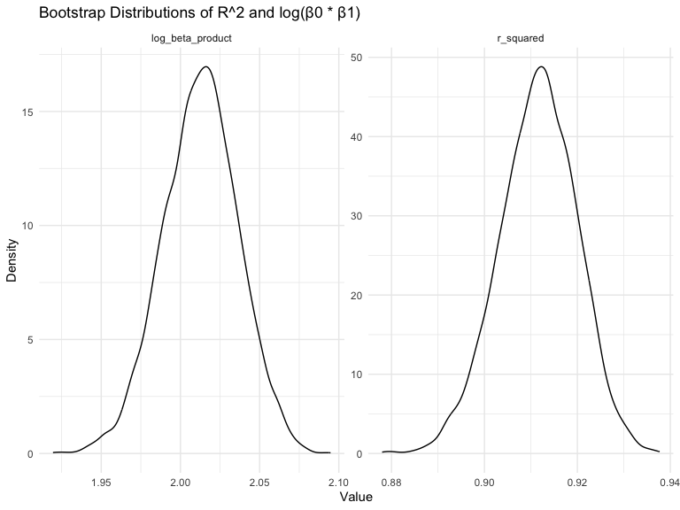

p8105 Homework 6
================
2024-12-03

Name \[UNI\]: Xi Peng \[xp2213\]

# Question 1: 2017 Central Park weather data

``` r
# Dataset download and processes.
weather_df = 
  rnoaa::meteo_pull_monitors(
    c("USW00094728"),
    var = c("PRCP", "TMIN", "TMAX"), 
    date_min = "2017-01-01",
    date_max = "2017-12-31") %>%
  mutate(
    name = recode(id, USW00094728 = "CentralPark_NY"),
    tmin = tmin / 10,
    tmax = tmax / 10) %>%
  select(name, id, everything())
```

    ## using cached file: /Users/eeeeee/Library/Caches/org.R-project.R/R/rnoaa/noaa_ghcnd/USW00094728.dly

    ## date created (size, mb): 2024-12-01 21:13:47.558893 (8.667)

    ## file min/max dates: 1869-01-01 / 2024-11-30

``` r
# Define a bootstrap sampling function.
boot_sample = function(df) {
  sample_frac(df, replace = TRUE)
}

# Bootstrap resampling.
boot_straps_result = tibble(strap_number = 1:5000) |> 
  mutate(
    strap_sample = map(strap_number, ~ boot_sample(weather_df)),
    models = map(strap_sample, ~ lm(tmax ~ tmin, data = .x)),
    results = map(models, tidy),                         
    r_squared = map_dbl(models, ~ glance(.x)$r.squared), 
    log_beta_product = map_dbl(models, ~ {       
      coefs = tidy(.x)  
      beta_0 = coefs |> filter(term == "(Intercept)") |> pull(estimate)
      beta_1 = coefs |> filter(term == "tmin") |> pull(estimate)
      log(abs(beta_0 * beta_1))
    })
  )

boot_straps_result
```

    ## # A tibble: 5,000 × 6
    ##    strap_number strap_sample       models results  r_squared log_beta_product
    ##           <int> <list>             <list> <list>       <dbl>            <dbl>
    ##  1            1 <tibble [365 × 6]> <lm>   <tibble>     0.912             2.01
    ##  2            2 <tibble [365 × 6]> <lm>   <tibble>     0.908             2.05
    ##  3            3 <tibble [365 × 6]> <lm>   <tibble>     0.912             2.03
    ##  4            4 <tibble [365 × 6]> <lm>   <tibble>     0.915             2.01
    ##  5            5 <tibble [365 × 6]> <lm>   <tibble>     0.898             2.00
    ##  6            6 <tibble [365 × 6]> <lm>   <tibble>     0.927             2.01
    ##  7            7 <tibble [365 × 6]> <lm>   <tibble>     0.905             2.02
    ##  8            8 <tibble [365 × 6]> <lm>   <tibble>     0.912             2.03
    ##  9            9 <tibble [365 × 6]> <lm>   <tibble>     0.922             2.02
    ## 10           10 <tibble [365 × 6]> <lm>   <tibble>     0.907             2.03
    ## # ℹ 4,990 more rows

<br> Plot the distribution of the estimates of the two quantities.

``` r
boot_straps_plot = 
  boot_straps_result |>
  select(r_squared, log_beta_product) |> 
  pivot_longer(cols = everything(), names_to = "metric", values_to = "value") |> 
  ggplot(aes(x = value)) +
  geom_density(alpha = 0.3) +
  facet_wrap(~metric, scales = "free") +
  labs(
    title = "Bootstrap Distributions of R^2 and log(β0 * β1)",
    x = "Value",
    y = "Density"
  )

boot_straps_plot
```



Both distributions show clear, bell-shaped curves with minimal skewness,
indicating that these statistics are stable and reliable across
different bootstrap samples.The plot indicates a strong linear
relationship between tmax and tmin in the weather data, as reflected by
the consistently high r_squared values and stable log_beta_product
values across 5000 bootstrap samples. The narrow distribution of
r_squared values demonstrates that the model explains a substantial
proportion of the variance in tmax, while the consistency of the
log_beta_product values indicates minimal variability in the
relationship between the coefficients. The large sample size of 5000
ensures that the distributions capture the true underlying pattern with
minimal variation across resampled datasets.

<br> 95% confidence interval for the two quantities.

``` r
CI_result = boot_straps_result |> 
  summarize(
    r_squared_CI = list(quantile(r_squared, c(0.025,0.975))),
    log_beta_product_CI = list(quantile(log_beta_product, c(0.025, 0.975)))
  ) 

knitr::kable(CI_result)
```

| r_squared_CI         | log_beta_product_CI |
|:---------------------|:--------------------|
| 0.8942244, 0.9271528 | 1.965358, 2.059243  |
