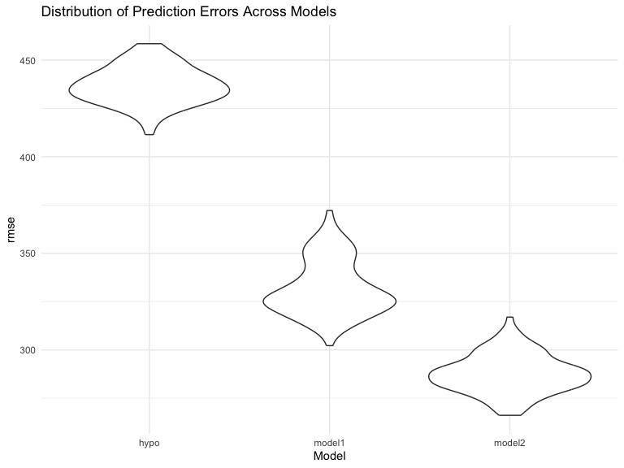

p8105 Homework 6
================
2024-12-03

Name \[UNI\]: Xi Peng \[xp2213\]

# Question 1: 2017 Central Park weather data

``` r
# Dataset download and processes.
weather_df = 
  rnoaa::meteo_pull_monitors(
    c("USW00094728"),
    var = c("PRCP", "TMIN", "TMAX"), 
    date_min = "2017-01-01",
    date_max = "2017-12-31") %>%
  mutate(
    name = recode(id, USW00094728 = "CentralPark_NY"),
    tmin = tmin / 10,
    tmax = tmax / 10) %>%
  select(name, id, everything())
```

    ## using cached file: /Users/eeeeee/Library/Caches/org.R-project.R/R/rnoaa/noaa_ghcnd/USW00094728.dly

    ## date created (size, mb): 2024-12-01 21:13:47.558893 (8.667)

    ## file min/max dates: 1869-01-01 / 2024-11-30

``` r
# Define a bootstrap sampling function.
boot_sample = function(df) {
  sample_frac(df, replace = TRUE)
}

# Bootstrap resampling.
boot_straps_result = tibble(strap_number = 1:5000) |> 
  mutate(
    strap_sample = map(strap_number, ~ boot_sample(weather_df)),
    models = map(strap_sample, ~ lm(tmax ~ tmin, data = .x)),
    results = map(models, tidy),                         
    r_squared = map_dbl(models, ~ glance(.x)$r.squared), 
    log_beta_product = map_dbl(models, ~ {       
      coefs = tidy(.x)  
      beta_0 = coefs |> filter(term == "(Intercept)") |> pull(estimate)
      beta_1 = coefs |> filter(term == "tmin") |> pull(estimate)
      log(abs(beta_0 * beta_1))
    })
  )

boot_straps_result
```

    ## # A tibble: 5,000 × 6
    ##    strap_number strap_sample       models results  r_squared log_beta_product
    ##           <int> <list>             <list> <list>       <dbl>            <dbl>
    ##  1            1 <tibble [365 × 6]> <lm>   <tibble>     0.912             2.01
    ##  2            2 <tibble [365 × 6]> <lm>   <tibble>     0.908             2.05
    ##  3            3 <tibble [365 × 6]> <lm>   <tibble>     0.912             2.03
    ##  4            4 <tibble [365 × 6]> <lm>   <tibble>     0.915             2.01
    ##  5            5 <tibble [365 × 6]> <lm>   <tibble>     0.898             2.00
    ##  6            6 <tibble [365 × 6]> <lm>   <tibble>     0.927             2.01
    ##  7            7 <tibble [365 × 6]> <lm>   <tibble>     0.905             2.02
    ##  8            8 <tibble [365 × 6]> <lm>   <tibble>     0.912             2.03
    ##  9            9 <tibble [365 × 6]> <lm>   <tibble>     0.922             2.02
    ## 10           10 <tibble [365 × 6]> <lm>   <tibble>     0.907             2.03
    ## # ℹ 4,990 more rows

<br> Plot the distribution of the estimates of the two quantities.

``` r
boot_straps_plot = 
  boot_straps_result |>
  select(r_squared, log_beta_product) |> 
  pivot_longer(cols = everything(), names_to = "metric", values_to = "value") |> 
  ggplot(aes(x = value)) +
  geom_density(alpha = 0.3) +
  facet_wrap(~metric, scales = "free") +
  labs(
    title = "Bootstrap Distributions of R^2 and log(β0 * β1)",
    x = "Value",
    y = "Density"
  )

boot_straps_plot
```


Both distributions show clear, bell-shaped curves with minimal skewness,
indicating that these statistics are stable and reliable across
different bootstrap samples.The plot indicates a strong linear
relationship between tmax and tmin in the weather data, as reflected by
the consistently high r_squared values and stable log_beta_product
values across 5000 bootstrap samples. The narrow distribution of
r_squared values demonstrates that the model explains a substantial
proportion of the variance in tmax, while the consistency of the
log_beta_product values indicates minimal variability in the
relationship between the coefficients. The large sample size of 5000
ensures that the distributions capture the true underlying pattern with
minimal variation across resampled datasets.

<br> 95% confidence interval for the two quantities.

``` r
CI_result = boot_straps_result |> 
  summarize(
    r_squared_CI = list(quantile(r_squared, c(0.025,0.975))),
    log_beta_product_CI = list(quantile(log_beta_product, c(0.025, 0.975)))
  ) 

knitr::kable(CI_result)
```

| r_squared_CI         | log_beta_product_CI |
|:---------------------|:--------------------|
| 0.8942244, 0.9271528 | 1.965358, 2.059243  |

# Question 2: Homicide Rates Across U.S. Cities

``` r
url = "https://raw.githubusercontent.com/washingtonpost/data-homicides/refs/heads/master/homicide-data.csv"

homi_data = read_csv(url) |> 
  janitor::clean_names() |> 
  mutate(
    city_state = str_c(city, ", ", state),
    resolved = as.numeric(disposition == "Closed by arrest"),
    victim_age = as.numeric(victim_age)
  ) |> 
  filter(
    !city_state %in% c("Dallas, TX", "Phoenix, AZ", "Kansas City, MO", "Tulsa, AL"),
    victim_race %in% c("White", "Black"), 
    !is.na(victim_age)
  )
```

    ## Rows: 52179 Columns: 12
    ## ── Column specification ────────────────────────────────────────────────────────
    ## Delimiter: ","
    ## chr (9): uid, victim_last, victim_first, victim_race, victim_age, victim_sex...
    ## dbl (3): reported_date, lat, lon
    ## 
    ## ℹ Use `spec()` to retrieve the full column specification for this data.
    ## ℹ Specify the column types or set `show_col_types = FALSE` to quiet this message.

In this step, the original dataset is imported, and two key variables
are created: city_state, which combines the city and state names, and a
binary variable, resolved, indicating whether the homicide was solved.
Cities that do not report victim race, such as Dallas, TX; Phoenix, AZ;
and Kansas City, MO, are excluded, along with Tulsa, AL, due to a data
entry error. The analysis is further narrowed to include only cases
where victim_race is recorded as either “White” or “Black” and
victim_age is confirmed as a numeric value.

<br> Analyze for Baltimore, MD

``` r
# Filter data for Baltimore, MD
Bal_MD = homi_data |> 
  filter(city_state == "Baltimore, MD") 

# Fit a logistic regression
Bal_MD_fit = glm(
  resolved ~ victim_age + victim_race + victim_sex,
  data = Bal_MD, family = binomial()
) |> 
  tidy()

knitr::kable(Bal_MD_fit, digits = 3)
```

| term             | estimate | std.error | statistic | p.value |
|:-----------------|---------:|----------:|----------:|--------:|
| (Intercept)      |    0.310 |     0.171 |     1.810 |   0.070 |
| victim_age       |   -0.007 |     0.003 |    -2.024 |   0.043 |
| victim_raceWhite |    0.842 |     0.175 |     4.818 |   0.000 |
| victim_sexMale   |   -0.854 |     0.138 |    -6.184 |   0.000 |

``` r
ORmale_Bal_MD = Bal_MD_fit |> 
  mutate(
    OR = exp(estimate),
    lower_CI = exp(estimate - 1.96 * std.error),
    upper_CI = exp(estimate + 1.96 * std.error)
  ) |> 
  filter(term == "victim_sexMale") |> 
  select(term, OR, lower_CI, upper_CI)

knitr::kable(ORmale_Bal_MD, digits = 3)
```

| term           |    OR | lower_CI | upper_CI |
|:---------------|------:|---------:|---------:|
| victim_sexMale | 0.426 |    0.325 |    0.558 |

``` r
# Fit a logistic regression for each city
all_city_results <- homi_data |> 
  group_by(city_state) |> 
  nest() |> 
  mutate(
    model = map(data, ~ glm(resolved ~ victim_age + victim_race + victim_sex, 
                            data = .x, family = binomial())),
    tidy_results = map(model, ~ tidy(.x) |> 
                         filter(term == "victim_sexMale") |> 
                         mutate(
                           OR = exp(estimate),
                           lower_CI = exp(estimate - 1.96 * std.error),
                           upper_CI = exp(estimate + 1.96 * std.error)
                         ))
  ) |> 
  unnest(tidy_results) |> 
  select(city_state, OR, lower_CI, upper_CI)

knitr::kable(all_city_results, digits = 3)
```

| city_state         |    OR | lower_CI | upper_CI |
|:-------------------|------:|---------:|---------:|
| Albuquerque, NM    | 1.767 |    0.831 |    3.761 |
| Atlanta, GA        | 1.000 |    0.684 |    1.463 |
| Baltimore, MD      | 0.426 |    0.325 |    0.558 |
| Baton Rouge, LA    | 0.381 |    0.209 |    0.695 |
| Birmingham, AL     | 0.870 |    0.574 |    1.318 |
| Boston, MA         | 0.674 |    0.356 |    1.276 |
| Buffalo, NY        | 0.521 |    0.290 |    0.935 |
| Charlotte, NC      | 0.884 |    0.557 |    1.403 |
| Chicago, IL        | 0.410 |    0.336 |    0.501 |
| Cincinnati, OH     | 0.400 |    0.236 |    0.677 |
| Columbus, OH       | 0.532 |    0.378 |    0.750 |
| Denver, CO         | 0.479 |    0.236 |    0.971 |
| Detroit, MI        | 0.582 |    0.462 |    0.734 |
| Durham, NC         | 0.812 |    0.392 |    1.683 |
| Fort Worth, TX     | 0.669 |    0.397 |    1.127 |
| Fresno, CA         | 1.335 |    0.580 |    3.071 |
| Houston, TX        | 0.711 |    0.558 |    0.907 |
| Indianapolis, IN   | 0.919 |    0.679 |    1.242 |
| Jacksonville, FL   | 0.720 |    0.537 |    0.966 |
| Las Vegas, NV      | 0.837 |    0.608 |    1.154 |
| Long Beach, CA     | 0.410 |    0.156 |    1.082 |
| Los Angeles, CA    | 0.662 |    0.458 |    0.956 |
| Louisville, KY     | 0.491 |    0.305 |    0.790 |
| Memphis, TN        | 0.723 |    0.529 |    0.988 |
| Miami, FL          | 0.515 |    0.304 |    0.872 |
| Milwaukee, wI      | 0.727 |    0.499 |    1.060 |
| Minneapolis, MN    | 0.947 |    0.478 |    1.875 |
| Nashville, TN      | 1.034 |    0.685 |    1.562 |
| New Orleans, LA    | 0.585 |    0.422 |    0.811 |
| New York, NY       | 0.262 |    0.138 |    0.499 |
| Oakland, CA        | 0.563 |    0.365 |    0.868 |
| Oklahoma City, OK  | 0.974 |    0.624 |    1.520 |
| Omaha, NE          | 0.382 |    0.203 |    0.721 |
| Philadelphia, PA   | 0.496 |    0.378 |    0.652 |
| Pittsburgh, PA     | 0.431 |    0.265 |    0.700 |
| Richmond, VA       | 1.006 |    0.498 |    2.033 |
| San Antonio, TX    | 0.705 |    0.398 |    1.249 |
| Sacramento, CA     | 0.669 |    0.335 |    1.337 |
| Savannah, GA       | 0.867 |    0.422 |    1.780 |
| San Bernardino, CA | 0.500 |    0.171 |    1.462 |
| San Diego, CA      | 0.413 |    0.200 |    0.855 |
| San Francisco, CA  | 0.608 |    0.317 |    1.165 |
| St. Louis, MO      | 0.703 |    0.530 |    0.932 |
| Stockton, CA       | 1.352 |    0.621 |    2.942 |
| Tampa, FL          | 0.808 |    0.348 |    1.876 |
| Tulsa, OK          | 0.976 |    0.614 |    1.552 |
| Washington, DC     | 0.690 |    0.468 |    1.017 |

<br> Plot of the estimated ORs and CIs for all city.

``` r
all_city_results_plot = 
  all_city_results |> 
  ggplot(aes(x = reorder(city_state, OR), y = OR)) +
  geom_point() +
  geom_errorbar(aes(ymin = lower_CI, ymax = upper_CI), width = 0.2) +
  coord_flip() +
  labs(
    title = "Odds Ratios for Solving Homicides (Male vs Female Victims)",
    x = "City",
    y = "Odds Ratio"
  )

all_city_results_plot
```


The plot reveals that in most cities, the ORs are below 1, suggesting
that cases involving female victims are more likely to be resolved
compared to those involving male victims. However, the CIs for the
majority of cities include the null value of 1, indicating that these
differences in case resolution rates between male and female victims are
not statistically significant. Cities such as Stockton, CA, Fresno, CA,
Richmond, VA, Tampa, FL, and San Bernardino, CA exhibit notably wider
confidence intervals, which may reflect greater variability or smaller
sample sizes relative to other cities. Albuquerque, NM stands out with a
substantially higher OR and an exceptionally wide CI, making it a
potential outlier that warrants further investigation to understand the
underlying factors contributing to this result.

# Question 3: Child’s birthweight

``` r
# Dataset import and clean
child_birthweight =
    read_csv("data/birthweight.csv", na = c("NA", "", ".", " ")) |> 
  janitor::clean_names() |> 
  drop_na() |> 
  mutate(
    babysex = factor(babysex, levels = c(1, 2), labels = c("Male", "Female")),
    frace = factor(frace, levels = c(1, 2, 3, 4, 8, 9), labels = c("White", "Black", "Asian", "Puerto Rican", "Other", "Unknown")),
    mrace = factor(mrace, levels = c(1, 2, 3, 4, 8), labels = c("White", "Black", "Asian", "Puerto Rican", "Other")),
    malform = factor(malform, levels = c(0, 1), labels = c("Absent", "Present")),
  )
```

    ## Rows: 4342 Columns: 20
    ## ── Column specification ────────────────────────────────────────────────────────
    ## Delimiter: ","
    ## dbl (20): babysex, bhead, blength, bwt, delwt, fincome, frace, gaweeks, malf...
    ## 
    ## ℹ Use `spec()` to retrieve the full column specification for this data.
    ## ℹ Specify the column types or set `show_col_types = FALSE` to quiet this message.

During this step, the original dataset was imported, and necessary
variables (babysex, frace, mrace, and malform) were converted from
numeric to factors to ensure they are treated as categorical variables
in the analysis. Missing values were checked.

<br> Propose a regression model for birthweight.

``` r
hypo_birthw_model = 
  lm(bwt ~ babysex + delwt + gaweeks + mheight + momage + ppbmi + ppwt + smoken + wtgain + parity + pnumlbw + pnumsga, data = child_birthweight 
     )

hypo_birthw_model |> 
  glance() |> 
  knitr::kable(digits = 3)
```

| r.squared | adj.r.squared | sigma | statistic | p.value | df | logLik | AIC | BIC | deviance | df.residual | nobs |
|---:|---:|---:|---:|---:|---:|---:|---:|---:|---:|---:|---:|
| 0.273 | 0.272 | 437.015 | 181.12 | 0 | 9 | -32555.25 | 65132.49 | 65202.63 | 827335306 | 4332 | 4342 |

The modeling process is designed based on based on a hypothesized
structure by identifying biological and behavioral factors known to
influence birthweight. First, it is well-established that birthweight
differs between male and female infants, making babysex a critical
variable. Maternal physical characteristics significantly impact
birthweight, including delwt (mother’s weight at delivery), gaweeks
(gestational age in weeks), mheight (mother’s height), momage (mother’s
age at delivery), ppbmi (mother’s pre-pregnancy BMI), and ppwt (mother’s
pre-pregnancy weight). Additionally, maternal health behaviors, such as
smoken (average number of cigarettes smoked per day during pregnancy)
and wtgain (mother’s weight gain during pregnancy), play a pivotal role
in determining birth outcomes. Lastly, prior obstetric history,
including parity (number of previous live births), pnumlbw (number of
previous low birthweight babies), and pnumgsa (number of prior
small-for-gestational-age babies), is incorporated to account for its
influence on birthweight.

<br> Plot of model residuals against fitted values.

``` r
child_birthweight_plot = child_birthweight |> 
  add_predictions(hypo_birthw_model) |> 
  add_residuals(hypo_birthw_model) |> 
  ggplot(aes(x = pred, y = resid)) +
  geom_point(alpha = 0.3) +
  geom_hline(yintercept = 0, color = "red") +
  labs(
    title = "Residuals vs Fitted Values",
    x = "Fitted Values",
    y = "Residuals"
  )

child_birthweight_plot
```


<br> Model comparison.

``` r
# Fit the two models based on the instructions.
model_1 = 
  lm(bwt ~ blength + gaweeks, data = child_birthweight)

model_2 = 
  lm(bwt ~ bhead + blength + babysex + bhead:blength + bhead:babysex + blength:babysex + bhead:blength:babysex, data = child_birthweight)

summary(model_1)
```

    ## 
    ## Call:
    ## lm(formula = bwt ~ blength + gaweeks, data = child_birthweight)
    ## 
    ## Residuals:
    ##     Min      1Q  Median      3Q     Max 
    ## -1709.6  -215.4   -11.4   208.2  4188.8 
    ## 
    ## Coefficients:
    ##              Estimate Std. Error t value Pr(>|t|)    
    ## (Intercept) -4347.667     97.958  -44.38   <2e-16 ***
    ## blength       128.556      1.990   64.60   <2e-16 ***
    ## gaweeks        27.047      1.718   15.74   <2e-16 ***
    ## ---
    ## Signif. codes:  0 '***' 0.001 '**' 0.01 '*' 0.05 '.' 0.1 ' ' 1
    ## 
    ## Residual standard error: 333.2 on 4339 degrees of freedom
    ## Multiple R-squared:  0.5769, Adjusted R-squared:  0.5767 
    ## F-statistic:  2958 on 2 and 4339 DF,  p-value: < 2.2e-16

``` r
summary(model_2)
```

    ## 
    ## Call:
    ## lm(formula = bwt ~ bhead + blength + babysex + bhead:blength + 
    ##     bhead:babysex + blength:babysex + bhead:blength:babysex, 
    ##     data = child_birthweight)
    ## 
    ## Residuals:
    ##      Min       1Q   Median       3Q      Max 
    ## -1132.99  -190.42   -10.33   178.63  2617.96 
    ## 
    ## Coefficients:
    ##                               Estimate Std. Error t value Pr(>|t|)    
    ## (Intercept)                 -7176.8170  1264.8397  -5.674 1.49e-08 ***
    ## bhead                         181.7956    38.0542   4.777 1.84e-06 ***
    ## blength                       102.1269    26.2118   3.896 9.92e-05 ***
    ## babysexFemale                6374.8684  1677.7669   3.800 0.000147 ***
    ## bhead:blength                  -0.5536     0.7802  -0.710 0.478012    
    ## bhead:babysexFemale          -198.3932    51.0917  -3.883 0.000105 ***
    ## blength:babysexFemale        -123.7729    35.1185  -3.524 0.000429 ***
    ## bhead:blength:babysexFemale     3.8781     1.0566   3.670 0.000245 ***
    ## ---
    ## Signif. codes:  0 '***' 0.001 '**' 0.01 '*' 0.05 '.' 0.1 ' ' 1
    ## 
    ## Residual standard error: 287.7 on 4334 degrees of freedom
    ## Multiple R-squared:  0.6849, Adjusted R-squared:  0.6844 
    ## F-statistic:  1346 on 7 and 4334 DF,  p-value: < 2.2e-16

``` r
cv_df =
  crossv_mc(child_birthweight, 100) |> 
  mutate(
    train = map(train, as_tibble),
    test = map(test, as_tibble)) |> 
  mutate(
    hypo_mod = map(train, ~ lm(bwt ~ babysex + delwt + gaweeks + mheight + momage + ppbmi + ppwt + smoken + wtgain + parity + pnumlbw + pnumsga, data = .x)),
    model1_mod = map(train, ~ lm(bwt ~ blength + gaweeks, data = .x)),
    model2_mod = map(train, ~ lm(bwt ~ bhead + blength + babysex + bhead:blength + bhead:babysex + blength:babysex + bhead:blength:babysex, data = .x))
  ) |> 
  mutate(
    rmse_hypo = map2_dbl(hypo_mod, test, ~rmse(model = .x, data = .y)),
    rmse_model1 = map2_dbl(model1_mod, test, ~rmse(model = .x, data = .y)),
    rmse_model2 = map2_dbl(model2_mod, test, ~rmse(model = .x, data = .y))
  )

# Visualization of prediction error distributions
cv_df_plot = cv_df |> 
  select(starts_with("rmse")) |>
  pivot_longer(
    everything(),
    names_to = "model",
    values_to = "rmse",
    names_prefix = "rmse_"
  ) |>
  mutate(model = fct_inorder(model)) |>
  ggplot(aes(x = model, y = rmse)) + 
  geom_violin() +
  labs(
    title = "Distribution of Prediction Errors Across Models",
    x = "Model",
    y = "rmse"
  )

cv_df_plot
```



The plot depicts the distribution of RMSE values for the three models
after 100 cross-validation splits. Among these three models, the
“model2,” which includes head circumference, length, sex, and all
interactions, has the lowest RMSE and the narrowest error distribution,
suggesting it provides the most accurate and consistent predictions
among the three models.
